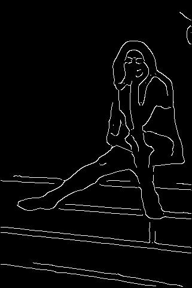
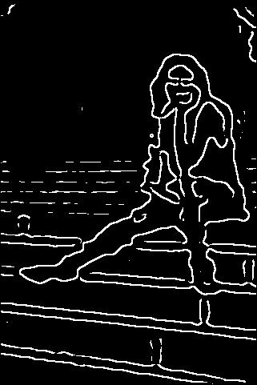

# Edge Detection Analysis: Canny vs. Marr–Hildreth

<p align="center">


</p>

Implementation and evaluation of **Canny** and **Marr–Hildreth (Laplacian of Gaussian)** edge detectors from scratch, including several improvements over the classical algorithms. The project compares both methods quantitatively on the **BSDS benchmark dataset** and qualitatively through visual examples. 

---

## Features

- From-scratch implementation of the **Canny Edge Detector**
- From-scratch implementation of the **Marr–Hildreth (LoG) Edge Detector**
- Adaptive preprocessing pipeline
- Quantitative evaluation against BSDS ground truth
- Precision, Recall and F1-score computation
- Visual comparison between algorithms
- CSV export of evaluation metrics

---

# Repository Structure

```text
.
├── canny/
├── marr/
├── real/
├── examples/
│   ├── canny/
│   ├── marr/
│   └── real/
├── images/
├── edge_metrics_comparison.csv
├── README.md
└── ...
```

---

# Methodology

Both algorithms share the same preprocessing pipeline to ensure a fair comparison.

### Common Preprocessing

- Convert image to grayscale
- Gaussian smoothing (σ = 3.0, kernel size 11×11)
- Adaptive local variance weighting
- Intensity normalization

These preprocessing steps improve robustness against noisy and low-contrast images.
---

## Canny Edge Detector

Implementation stages:

1. Gaussian smoothing
2. Sobel gradient computation
3. Gradient magnitude and direction
4. Non-maximum suppression
5. Double thresholding
6. Hysteresis edge tracking

Additional improvements include:

- Adaptive percentile-based thresholds
- Improved Non-Maximum Suppression
- Refined hysteresis
- Weak-edge suppression
- Better noise handling through preprocessing
---

## Marr–Hildreth (LoG)

Implementation stages:

1. Gaussian smoothing
2. Laplacian of Gaussian convolution
3. Zero-crossing detection
4. Edge extraction

Additional improvements include:

- Gradient magnitude constraint
- Magnitude difference filtering
- Tunable thresholds
- LoG response normalization

These additions significantly reduce false zero-crossings and improve contour localization. 

---

# Dataset

Evaluation was performed on **200 noisy test images** using the **Berkeley Segmentation Dataset (BSDS)**.

Ground truth boundaries were compared using:

- Precision
- Recall
- F1-score

A **2-pixel tolerance** was used during evaluation to compensate for minor localization differences. 

---

# Results

| Method | Precision | Recall | F1 Score |
|---------|----------:|--------:|----------:|
| Canny | **0.388 ± 0.152** | 0.542 ± 0.126 | 0.432 ± 0.116 |
| Marr–Hildreth | 0.350 ± 0.140 | **0.748 ± 0.097** | **0.457 ± 0.130** |

Overall observations:

- **Canny** produces thinner and more accurately localized edges.
- **Marr–Hildreth** detects more complete edge structures with higher recall.
- Marr–Hildreth achieved the best overall F1-score in this evaluation. 

---

# Example Output

## Original Image


---

## Canny Edge Detection



---

## Marr–Hildreth Edge Detection



---

# Running

```bash
python main.py
```

or execute the individual implementations directly.

The evaluation metrics will be generated and saved as:

```text
edge_metrics_comparison.csv
```

---

# Key Takeaways

- Adaptive preprocessing noticeably improves both detectors.
- Canny excels in edge localization and produces cleaner contours.
- Marr–Hildreth captures more complete boundaries and achieves a higher overall F1-score.
- Both methods detect finer structures than human-annotated BSDS boundaries, producing richer geometric detail.

---

# References

1. John F. Canny, *A Computational Approach to Edge Detection*, IEEE TPAMI, 1986.
2. David Marr & Ellen Hildreth, *Theory of Edge Detection*, Proceedings of the Royal Society B, 1980.